# (老铁建BUG修改记录


## 说明

* 所有的标题采取: `BUG自定义编号-年 月 日-BUG简单描述`
  * 只有需要更新正式服务器源码的BUG才有必要书写自定义编号, 对应`服务器源码的备份编号`.
* `>`代表子问题, 也就是同类问题再次出现, 使用3级标题.
* `*`代表重要问题, 需要重新部署服务器代码, 需要给出时间和BUG编号等信息.


## 190627-隐患华北跑华南

`问题原因`


有2条华北的隐患记录跑到华南分公司.

`解决方案`

* 将被检查公司当中的**华南分公司(南方公司)**去除.
* 将这两个隐患的所属工程修改为**华北分公司**下的工程.

```sql
-- 查询
select * from check_check where id in 
(select c.id from check_hiddendanger h join check_check c on h.checkid = c.id  where h.id in (971264, 971261));
-- 第一项修改
-- 原: 12,780,1252,1506,      1506
-- 新: 12,774,1506,2490,      2090
update check_check set projectoId = '2090', departids = '12,774,1506,2490,' where id in
(select c.id from check_hiddendanger h join check_check c on h.checkid = c.id  where h.id in (971264, 971261));
-- 第二项修改
update check_check set checkedcompany = '华北分公司第30项目部' where id in
(select c.id from check_hiddendanger h join check_check c on h.checkid = c.id  where h.id in (971264, 971261));
```


### > 190722-华北跑西北

`问题描述`


`解决方案`

```sql
-- 查询
select * from check_check where id in 
(select c.id from check_hiddendanger h join check_check c on h.checkid = c.id  where h.id in (998042, 998041, 998040, 998039));
-- 第一项修改
-- 原: 12,776,938,1544,       1544
-- 新: 12,774,1544,2622,      2622
update check_check set projectoId = '2622', departids = '12,774,1544,2622,' where id in
(select c.id from check_hiddendanger h join check_check c on h.checkid = c.id  where h.id in (998042, 998041, 998040, 998039));
-- 第二项修改
-- 原: 西北分公司华北分公司第37项目部
-- 新: 华北分公司第37项目部
update check_check set checkedcompany = '华北分公司第37项目部' where id in
(select c.id from check_hiddendanger h join check_check c on h.checkid = c.id  where h.id in (998042, 998041, 998040, 998039));
```


## 190701-委外审核大BUG

`问题原因`


如图所描述...

`解决方案`

* 点击委外审核录入之后, 客户应该点击[提交审核], 而并非[保存].


## 190702-安卓端整改回复无隐患

`问题原因`


如果所示...

`解决方案`

网络问题, 有时候能加载出来, 有时候无法加载出来, 并非项目问题.


## 190703-整改回复出现两次

`问题原因`


第一次已整改验证通过，但过几天用手机APP查看时，隐患状态为未整改，项目部又重新提交整改回复，造成整改逾期。

`所需工具`

* `杨巷相` `yxx13557132689`

`解决方案`

* 将数据库中多余的第二次整改回复删除.
* 将第二次整改回复的审核记录移除(转移ID).

```sql
-- 修改语句
update CHECK_CHECKREPLY set HIDDENID = '1919810' where id = '633876';
update check_CheckAuditing set relationID = '1919810' where id = '1155914';
-- 恢复语句
update CHECK_CHECKREPLY set HIDDENID = '977363' where id = '633876';
update check_CheckAuditing set relationID = '977363' where id = '1155914';
```


## 190704-无隐患vs逾期天数

`问题描述`


个别隐患是无隐患, 可是出现了整改截止日期不为NULL的情况, 从而导致出现逾期天数.

`所需工具`

* `吴玉珍1` `wuxinyuan110127`
* `983489` `955611` `953858` `953857` 所需要修改的几个隐患ID

`相关分析`

```sql
--	 cca.lastDate 	最后审核的日期
--	 ch.endTime		整改截止日期
-- 	 GETDATE()		今天的日期
-- 如果没有审核的 ==> 
--   如果 整改截止日期不是今天 => 返回(+差几天)
--   如果 整改截止日期是今天   => 返回NULL
-- 如果有审核的了
--   如果最后审核的日期还没超过整改截止日期 ==> 返回NULL
--   如果最后审核日期已经过了整改截止日期 ==> 返回(-过了几天)
-- tip: select datediff(day, NULL, GETDATE()) = NULL;
select 
	case 
		when cca.lastDate is null and datediff(day,ch.endtime,GETDATE())!=0 
			then datediff(day,ch.endtime,GETDATE()) 
		when cca.lastDate is null and datediff(day,ch.endtime,GETDATE())=0 
			then null              3.6      3.5
		when datediff(day,ch.endtime,cca.lastDate)<=0 
			then null
    else datediff(day,ch.endtime,cca.lastDate)  
end as num,
from check_hiddendanger ch 
left join (
	select MAX(AuditingDate) lastDate,relationID 
	from check_checkAuditing 
	where type='0' group by relationID
) cca  on cca.relationID=ch.ID and ch.prop1=40  ......
```

`解决方案`

* 通知前端人员修改小程序代码.
* 直接修改几个隐患的整改截止日期即可, 从而逾期天数就会变化.

```sql
-- 查询语句
select id, hdDescribe, EndTime from check_hiddendanger where id in (983489, 955611, 953858, 953857);
-- 恢复语句
update check_hiddendanger set EndTime = '2019-07-01 00:00:00.000' where id = 983489;
update check_hiddendanger set EndTime = '2019-06-06 00:00:00.000' where id = 955611;
update check_hiddendanger set EndTime = '2019-06-04 00:00:00.000' where id = 953858;
update check_hiddendanger set EndTime = '2019-06-04 00:00:00.000' where id = 953857;
-- 修改语句
update check_hiddendanger set EndTime = NULL where id = 983489;
update check_hiddendanger set EndTime = NULL where id = 955611;
update check_hiddendanger set EndTime = NULL where id = 953858;
update check_hiddendanger set EndTime = NULL where id = 953857;
```


### 190923 再次出现如上问题

`问题描述`

还是上面的账号又出现了这个问题, 原因是`app端无隐患的记录整改截止日期没有置为NULL`.

`解决方案`

```sql
-- 查询语句
select id, hdDescribe, EndTime from check_hiddendanger where id in (1068194, 1067044, 1061776);
-- 恢复语句
update check_hiddendanger set EndTime = '2019-09-13 00:00:00.000' where id = 1068194;
update check_hiddendanger set EndTime = '2019-09-18 00:00:00.000' where id = 1067044;
update check_hiddendanger set EndTime = '2019-09-19 00:00:00.000' where id = 1061776;
-- 修改语句
update check_hiddendanger set EndTime = NULL where id = 1068194;
update check_hiddendanger set EndTime = NULL where id = 1067044;
update check_hiddendanger set EndTime = NULL where id = 1061776;
```

​	

## 190709-工程列表不显示

`问题描述`

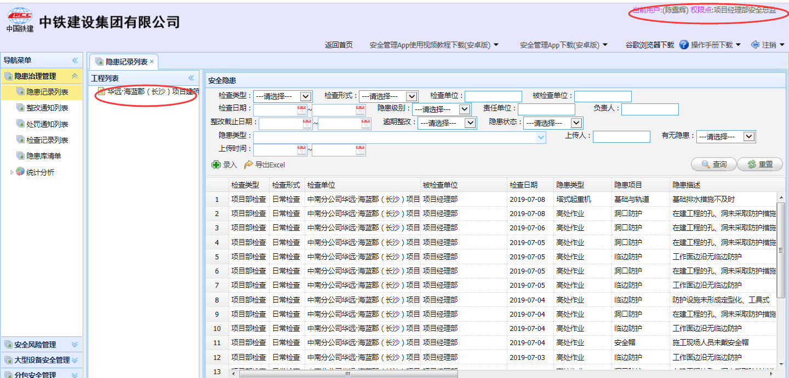

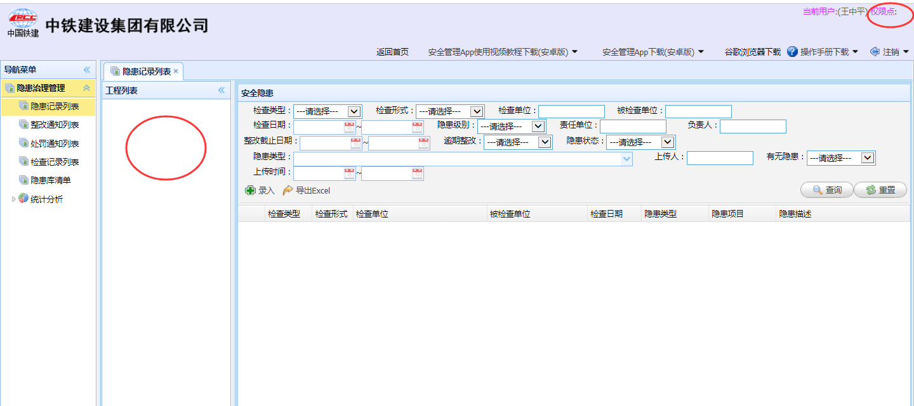

中南分公司某项目基础角色登录系统，不显示工程列表，无法进行隐患、危险作业等的录入，但安全总监登录可以显示工程列表.

`相关工具` 

* `陈露辉` `a414562843` `王中平` `137166`

`解决方案`

首先我们DEBUG跟踪代码可以跟踪到`ZTJUtils#getZTJProjectEngineering()`方法, 这个方法从`甲方数据库`和`我们的数据库`当中共同查询到当前用户应该有的工程, 然后加载到主页左侧的工程列表, 但是我们本地数据库中`王中平`并没有这条工程记录, 所有说加上工程记录即可:

```sql
-- 修改语句
insert into t_s_role_position values (
	'05e3d87f-5cdb-423d-9c90-857ca389bcfd', 
	'402887b941ed39fe0141ed3b3b5f0002', 
	'151937', '2723', '0', '安全员', 
 	'第24项目部长沙华远海蓝郡工程', 
 	'中南分公司/中南分公司湖南、贵州片区项目部'
);
-- 恢复语句
delete from t_s_role_position where id = '05e3d87f-5cdb-423d-9c90-857ca389bcfd';
```


## 190717-大型设备无待审核

`问题描述`

项目上的一台塔吊一直显示是待审核状态 但是没有下一审核人 .98

`相关工具`

* `高福建` ` 20170502`

`解决方案`

经过查看, 大型设备的状态为`12(待审核)`, 但是没有待审核列表, 应该是网络导致的问题, 只需要修改状态为`10(进场中)`, 然后再次提交审核即可.

```sql
-- 修改语句
update EQUP_Equipment_base_info set status = '10' where id = '6412'
---------------- 修改完之后在该大型设备点击编辑, 点击提交审核即可.
-- 恢复语句
update EQUP_Equipment_base_info set status = '12' where id = '6412'
```


## 190717-委外未出现审核

`问题描述`

大型机械设备系统，项目提交信息后，系统未出现审核角色.

`相关工具`

* `应江波` `6656776`

`修复以前的数据`

以前的数据恢复思路就是将`委外审核的状态`修改为`待审核`, 也就是`可以编辑`的状态, 然后重新`提交审核`即可.

```sql
-- 查询语句
select status from EQUP_process_third_test where id in ('3591', '3586', '3587', '3588');
-- 修改语句
update EQUP_process_third_test set status = '5' where id in ('3591', '3586', '3587', '3588');
-- 恢复语句
update EQUP_process_third_test set status = '10' where id in ('3591', '3586', '3587', '3588');
```

`保证以后不会再出现`

**问题一: 新录入的委外审核, 点击[提交审核]操作, 出现错误.**

通过DEBUG, 最终定位到了`ZTJUtils#saveEqupEval()#402`上, 因为没有追加`空指针校验`.

```java
if (roleList.get(r).equals(role.getRoleName())) {
    // 下面的pb不能保证不为NULL
    PositionBean pb = SSOUtils.getPosByID(Integer.valueOf(rp.getPoid()));
    try {
        // 下面这行应该增加 pb.nn 校验
        UserBean[] ubs = userServiceProxy.getPositionUsers(pb.getId());
        for (UserBean userBean : ubs) {
            System.out.println(role.getRoleName()+":"+userBean.getName());
        }
    } ......
    EqupEvalwoEntity ee = new EqupEvalwoEntity();
    setEvalwoProp1(ee,equpEvalwoService,auditType,relationId);
    // 下面这行应该增加 pb.nn 校验
    ee.setAuditUser(pb.getId()+"");
    ......
}
```

**问题二: 对于保存的委外审核, 点击[编辑], 资质等级无法录入.**

通过异常信息, 得知是JSP页面当中的EL表达式出现了错误, 修复即可.

```jsp
<!-- processThirdTsetPage.qualGrade的类型为String, 所以应该写成'1', '2', '3' -->
<select name="qualGrade" style="width:300px" id="qualGrade">
    <option value="1" <c:if test="${processThirdTsetPage.qualGrade==1}"> selected </c:if>>一级</option>
	<option value="2" <c:if test="${processThirdTsetPage.qualGrade==2}"> selected </c:if>>二级</option>
	<option value="3" <c:if test="${processThirdTsetPage.qualGrade==3}"> selected </c:if>>三级</option>
</select>
```


## 190719-作业单位全称=分公司

`问题描述`

风险作业提交评价之后作业单位全称和分公司名称变成一样的了.

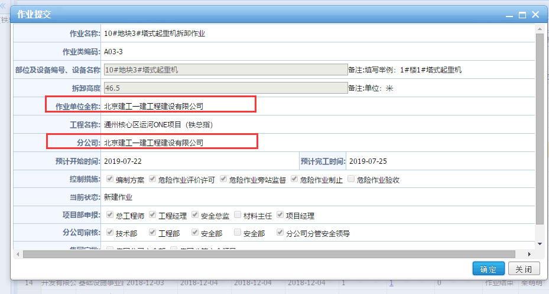

`解决方案`

由于**每个账号**下都有这个问题, 所以是页面的错误:

```jsp
<tr>
    <td align="right" height="30px"><label class="Validform_label"> 作业单位全称: </label></td>
    <td colspan="3" class="value">${taskPage.subcontractor}
        <span class="Validform_checktip"></span></td>
</tr>
...
<tr>
    <td align="right" height="30px"><label class="Validform_label">分公司:</label></td>
    <td colspan="3" class="value">${taskPage.subcontractor}</td>
</tr>
```

从上面代码上可以看出`作业单位全称`和`分公司`获取的都是`subcontractor`这个字段, 所以说出现了错误, 需要将**分公司的修改为**`subcompany`.


## * 124-190802-大型设备无记录

`问题描述`

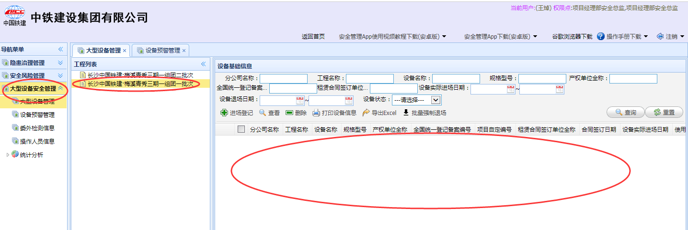

王焯的账号项目下大型设备并没有记录, 实际上应该是有记录的.

`问题分析`

通过源码跟踪, 我们最终跟踪到了`LMUtils#getSqlAdd()`方法, 这个方法用于获取当前用户所有工程的SQL, 最终效果类似于这种:

```sql
and ( t.departids like'%,2112,' or t.departids like'%,2111,' )
```

而一个用户下工程可能来自于两个位置, `人力系统岗位所在部门`下的工程, 或者`在我们系统岗位授权`的工程, 而问题就在这段代码上:

`解决方案`

```java
for (int j = 0; j < pbss.length; j++) {
    //人力系统岗位所在部门下所有工程
    List<ProjectAbstract> pasList = ProjectUtils.getDepProjectByPos(pbss[j].getId());//根据岗位ID获取岗位所在部门下所有工程
    for (int i = 0; pasList != null && i < pasList.size(); i++) {
        boolean flag = true;
        for (ProjectAbstract pa : prolist) {
            if(pa.getId()==pasList.get(i).getId()){
                flag = false;//列表中已经存在
            }
        }
        if(flag){
            //如果列表中不存在该工程，加入列表
            if(m==0){
                sqladd+= " "+departids+" like'%,"+pasList.get(i).getId()+",' ";
                m++;
            }else{
                sqladd+= " or "+departids+" like'%,"+pasList.get(i).getId()+",' ";
            }
            prolist.add(pasList.get(i));
        }
    }

}
List<TSRolePositionEntity> rpList = rolePosService.getListByPostion(pbss);
int a = 0;
for (int i = 0; i < rpList.size(); i++) {
    //在我们系统岗位授权的所有工程
    ProjectAbstract pa = ProjectUtils.getProjectById(Integer.valueOf(rpList.get(i).getUserunitid()));
    if(pa==null)continue;
    boolean flag = true;
    for (ProjectAbstract p : prolist) {
        if(p.getId()==pa.getId()){
            flag = false;//列表中已经存在
        }
    }
    if(flag){
        if(m==0&&a==0){
            sqladd+= " "+departids+" like'%,"+pa.getId()+",' ";
            a++;
// >>>>>>>>>>>>>>>>>>>>>>>>>>>>
        }else if(a==0){			// 原代码: 获取我们系统下的一个工程之后就不再获取.
// >>>>>>>>>>>>>>>>>>>>>>>>>>>>
		}else {					// 新代码: 可以获取我们系统下的多个工程了.
// >>>>>>>>>>>>>>>>>>>>>>>>>>>>
            sqladd+=" or "+departids+" like'%,"+pa.getId()+",' ";
        }
        prolist.add(pa);
    }
}
if(StringUtil.isNotEmpty(sqladd)){
    sql+=" and (" + sqladd + " )";
}else{
    sql+=" and "+departids+" like'%,-1,' ";;
}
```


## 190802-安全隐患无法签发

`问题描述`

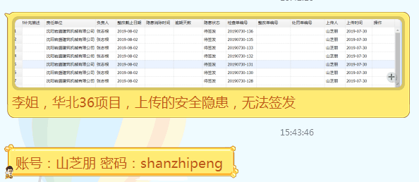

隐患列表中有隐患记录，状态为未签发，但整改通知单列表中查不到未签发记录.

`问题分析`

应该是录入`Check`的时候并没有保存好`HiddenDander`的`DangerNotice`记录, 具体原因未查明, 由于时间紧迫, 采用脚本进行数据恢复.

`解决方案`

```java

```

> 使用如上脚本需要注意一下几点:
>
> * 由于以前写过整改延期的相关功能, 已经提交代码, 但是正式库并没有拉取代码, 这意味着我们的脚本在本地代码连接正式数据库跑的话会出现问题, 需要先将整改延期的相关代码恢复到以前的版本才能跑通.
> * 脚本中的`{构造代码块}`中添加需要修改的隐患记录对象运行即可.


## * 125-190802-作业列表可修改

`问题描述`

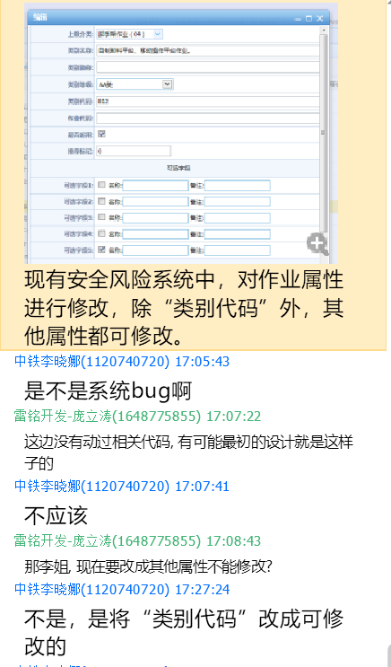

`解决方案`

```jsp
<td class="value" colspan="2">
    <input class="inputxt" id="categorycode" name="categorycode" ignore="ignore" 
<!-------------- 去掉下面这行即可 -->
        <c:if test="${!empty taskCategoryPage.id }">readonly="readonly"</c:if>
<!-------------- 去掉上面这行即可 -->
		style="width:100%"   value="${taskCategoryPage.categorycode}">
	<span class="Validform_checktip"></span>
</td>
```


## 190806-项目经理无待我评价

`问题描述`

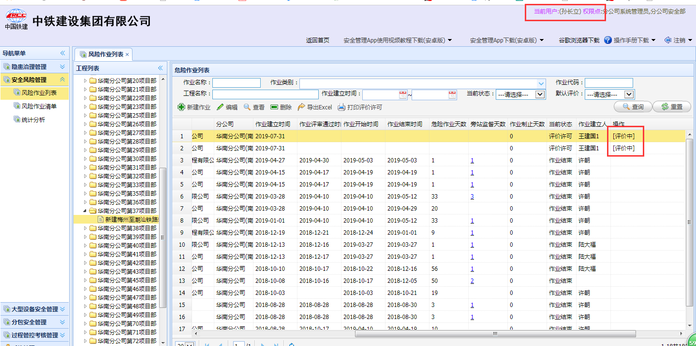

上图中的两条数据进行了两轮审核, 第二轮最后一次审核出现了数据丢失, 需要进行恢复.

`数据恢复`

经过查询, 丢失的是`task_evalwo`(待审核表)中的内容, 只需要我们手动添加即可.

```sql
-- 第一条记录
-- -- 查询所有的本轮需要审核的记录
select * from Task_AuditingDetail where AuditOID =
				(select id from TASK_Auditing where TaskOID = '103252') and DelFlag = 0;
-- -- 查询待审核表
select * from Task_evalwo where TASKID = '103252';
-- -- 修改语句
insert into task_evalwo values (NULL, NULL, '分公司技术部', NULL, '103252');
insert into task_evalwo values (NULL, NULL, '分公司工程部', NULL, '103252');
insert into task_evalwo values (NULL, NULL, '分公司物资部', NULL, '103252');
insert into task_evalwo values (NULL, NULL, '分公司安全部', NULL, '103252');
insert into task_evalwo values (NULL, NULL, '分管安全领导', NULL, '103252');
-- -- 恢复语句
delete from task_evalwo where id in ('280893' , '280894', '280895', '280896', '280901');


-- 第二条记录
-- -- 查询所有的本轮需要审核的记录
select * from Task_AuditingDetail where AuditOID =
				(select id from TASK_Auditing where TaskOID = '103253') and DelFlag = 0;
-- -- 查询待审核表
select * from Task_evalwo where TASKID = '103253';
-- -- 修改语句
insert into task_evalwo values (NULL, NULL, '分公司技术部', NULL, '103253');
insert into task_evalwo values (NULL, NULL, '分公司工程部', NULL, '103253');
insert into task_evalwo values (NULL, NULL, '分公司物资部', NULL, '103253');
insert into task_evalwo values (NULL, NULL, '分公司安全部', NULL, '103253');
insert into task_evalwo values (NULL, NULL, '分管安全领导', NULL, '103253');
-- -- 恢复语句
delete from task_evalwo where id in ('280902' , '280903', '280904', '280905', '280906');
```

### > 190826-项目经理无待我评价

`所需工具`

* `秦忠顺` `quinjinhld`

`解决方案`

```sql
-- 第1条记录[104074]
-- -- 查询所有的本轮需要审核的记录
select * from Task_AuditingDetail where AuditOID =
				(select id from TASK_Auditing where TaskOID = '104074') and DelFlag = 0;
-- -- 查询待审核表
select * from Task_evalwo where TASKID = '104074';
-- -- 修改语句
insert into task_evalwo values (NULL, NULL, '项目经理部项目经理', NULL, '104074');
insert into task_evalwo values (NULL, NULL, '分公司工程部', NULL, '104074');
insert into task_evalwo values (NULL, NULL, '分公司技术部', NULL, '104074');
insert into task_evalwo values (NULL, NULL, '分公司安全部', NULL, '104074');
insert into task_evalwo values (NULL, NULL, '分公司分管安全领导', NULL, '104074');
-- -- 恢复语句
delete from task_evalwo where id in ('284942' , '284943', '284944', '284945', '284946');

-- 第2条记录[104073]
-- -- 查询所有的本轮需要审核的记录
select * from Task_AuditingDetail where AuditOID =
				(select id from TASK_Auditing where TaskOID = '104073') and DelFlag = 0;
-- -- 查询待审核表
select * from Task_evalwo where TASKID = '104073';
-- -- 修改语句
insert into task_evalwo values (NULL, NULL, '项目经理部项目经理', NULL, '104073');
insert into task_evalwo values (NULL, NULL, '分公司工程部', NULL, '104073');
insert into task_evalwo values (NULL, NULL, '分公司技术部', NULL, '104073');
insert into task_evalwo values (NULL, NULL, '分公司安全部', NULL, '104073');
insert into task_evalwo values (NULL, NULL, '分公司分管安全领导', NULL, '104073');
-- -- 恢复语句
delete from task_evalwo where id in ('284947' , '284948', '284949', '284950', '284951');

-- 第3条记录[104076]
-- -- 查询所有的本轮需要审核的记录
select * from Task_AuditingDetail where AuditOID =
				(select id from TASK_Auditing where TaskOID = '104076') and DelFlag = 0;
-- -- 查询待审核表
select * from Task_evalwo where TASKID = '104076';
-- -- 修改语句
insert into task_evalwo values (NULL, NULL, '项目经理部项目经理', NULL, '104076');
insert into task_evalwo values (NULL, NULL, '分公司工程部', NULL, '104076');
insert into task_evalwo values (NULL, NULL, '分公司技术部', NULL, '104076');
insert into task_evalwo values (NULL, NULL, '分公司安全部', NULL, '104076');
insert into task_evalwo values (NULL, NULL, '分公司分管安全领导', NULL, '104076');
-- -- 恢复语句
delete from task_evalwo where id in ('284953' , '284954', '284955', '284956', '284957');

-- 第4条记录[104077]
-- -- 查询所有的本轮需要审核的记录
select * from Task_AuditingDetail where AuditOID =
				(select id from TASK_Auditing where TaskOID = '104077') and DelFlag = 0;
-- -- 查询待审核表
select * from Task_evalwo where TASKID = '104077';
-- -- 修改语句
insert into task_evalwo values (NULL, NULL, '项目经理部项目经理', NULL, '104077');
insert into task_evalwo values (NULL, NULL, '分公司工程部', NULL, '104077');
insert into task_evalwo values (NULL, NULL, '分公司技术部', NULL, '104077');
insert into task_evalwo values (NULL, NULL, '分公司安全部', NULL, '104077');
insert into task_evalwo values (NULL, NULL, '分公司分管安全领导', NULL, '104077');
-- -- 恢复语句
delete from task_evalwo where id in ('284958' , '284959', '284960', '284961', '284962');

-- 第5条记录[104078]
-- -- 查询所有的本轮需要审核的记录
select * from Task_AuditingDetail where AuditOID =
				(select id from TASK_Auditing where TaskOID = '104078') and DelFlag = 0;
-- -- 查询待审核表
select * from Task_evalwo where TASKID = '104078';
-- -- 修改语句
insert into task_evalwo values (NULL, NULL, '项目经理部项目经理', NULL, '104078');
insert into task_evalwo values (NULL, NULL, '分公司工程部', NULL, '104078');
insert into task_evalwo values (NULL, NULL, '分公司技术部', NULL, '104078');
insert into task_evalwo values (NULL, NULL, '分公司安全部', NULL, '104078');
insert into task_evalwo values (NULL, NULL, '分公司分管安全领导', NULL, '104078');
-- -- 恢复语句
delete from task_evalwo where id in ('284969' , '284970', '284971', '284972', '284973');

-- 第6条记录[104079]
-- -- 查询所有的本轮需要审核的记录
select * from Task_AuditingDetail where AuditOID =
				(select id from TASK_Auditing where TaskOID = '104079') and DelFlag = 0;
-- -- 查询待审核表
select * from Task_evalwo where TASKID = '104079';
-- -- 修改语句
insert into task_evalwo values (NULL, NULL, '项目经理部项目经理', NULL, '104079');
insert into task_evalwo values (NULL, NULL, '分公司工程部', NULL, '104079');
insert into task_evalwo values (NULL, NULL, '分公司技术部', NULL, '104079');
insert into task_evalwo values (NULL, NULL, '分公司安全部', NULL, '104079');
insert into task_evalwo values (NULL, NULL, '分公司分管安全领导', NULL, '104079');
-- -- 恢复语句
delete from task_evalwo where id in ('284963' , '284964', '284965', '284966', '284967');
```


### > 190909-同样的问题不再赘述

`所需工具`

* `迟长哲，147258` `董小珂，xkd123007`

`解决方案`

```sql
-- 第1条记录[103980]
-- -- 查询所有的本轮需要审核的记录
select * from Task_AuditingDetail where AuditOID =
				(select id from TASK_Auditing where TaskOID = '103980') and DelFlag = 0;
-- -- 查询待审核表
select * from Task_evalwo where TASKID = '103980';
-- -- 修改语句
insert into task_evalwo values (NULL, NULL, '项目经理部项目经理', NULL, '103980');
insert into task_evalwo values (NULL, NULL, '分公司工程部', NULL, '103980');
insert into task_evalwo values (NULL, NULL, '分公司技术部', NULL, '103980');
insert into task_evalwo values (NULL, NULL, '分公司安全部', NULL, '103980');
insert into task_evalwo values (NULL, NULL, '分公司分管安全领导', NULL, '103980');
-- -- 恢复语句
delete from task_evalwo where id in ('288481' , '288482', '288483', '288484', '288485');

-- 第2条记录[104092]
-- -- 查询所有的本轮需要审核的记录
select * from Task_AuditingDetail where AuditOID =
				(select id from TASK_Auditing where TaskOID = '104092') and DelFlag = 0;
-- -- 查询待审核表
select * from Task_evalwo where TASKID = '104092';
-- -- 修改语句
insert into task_evalwo values (NULL, NULL, '项目经理部项目经理', NULL, '104092');
insert into task_evalwo values (NULL, NULL, '分公司工程部', NULL, '104092');
insert into task_evalwo values (NULL, NULL, '分公司技术部', NULL, '104092');
insert into task_evalwo values (NULL, NULL, '分公司安全部', NULL, '104092');
insert into task_evalwo values (NULL, NULL, '分公司分管安全领导', NULL, '104092');
-- -- 恢复语句
delete from task_evalwo where id in ('288486' , '288487', '288488', '288489', '288490');

-- 第3条记录[103981]
-- -- 查询所有的本轮需要审核的记录
select * from Task_AuditingDetail where AuditOID =
				(select id from TASK_Auditing where TaskOID = '103981') and DelFlag = 0;
-- -- 查询待审核表
select * from Task_evalwo where TASKID = '103981';
-- -- 修改语句
insert into task_evalwo values (NULL, NULL, '项目经理部项目经理', NULL, '103981');
insert into task_evalwo values (NULL, NULL, '分公司工程部', NULL, '103981');
insert into task_evalwo values (NULL, NULL, '分公司技术部', NULL, '103981');
insert into task_evalwo values (NULL, NULL, '分公司安全部', NULL, '103981');
insert into task_evalwo values (NULL, NULL, '分公司分管安全领导', NULL, '103981');
-- -- 恢复语句
delete from task_evalwo where id in ('288558' , '288559', '288560', '288561', '288562');

-- 第4条记录[103983]
-- -- 查询所有的本轮需要审核的记录
select * from Task_AuditingDetail where AuditOID =
				(select id from TASK_Auditing where TaskOID = '103983') and DelFlag = 0;
-- -- 查询待审核表
select * from Task_evalwo where TASKID = '103983';
-- -- 修改语句
insert into task_evalwo values (NULL, NULL, '项目经理部项目经理', NULL, '103983');
insert into task_evalwo values (NULL, NULL, '分公司工程部', NULL, '103983');
insert into task_evalwo values (NULL, NULL, '分公司技术部', NULL, '103983');
insert into task_evalwo values (NULL, NULL, '分公司安全部', NULL, '103983');
insert into task_evalwo values (NULL, NULL, '分公司分管安全领导', NULL, '103983');
-- -- 恢复语句
delete from task_evalwo where id in ('288563' , '288564', '288565', '288566', '288567');
```


## 190812-进场登记无材料主任

`问题描述`

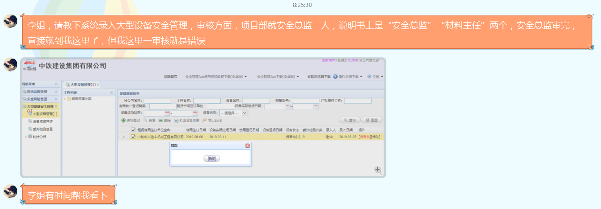

应该是安全总监、材料主任审核完后，分公司再审核，但现在系统是安全总监审核后，直接到分公司了，但分公司张俊进入系统后，系统出现错误信息。

`相关资料`

* 分公司: `张俊2` `0419z210cm221`
* 项目部安全总监 & 上传人: `赵坤` `zhaokun`

`问题分析`

首先途中所说的*但我这里已审核就是错误*是假的, 是可以点击的, 所以只是数据出了问题. 经过一步步的代码跟踪我们会发现, 此条大型设备基础信息, 再进场登记提交审核**保存**(EquipmentBaseInfoController#save#1262)的时候, 审核角色只是找到了安全总监, 而没有找到材料主任.

```java
quipmentBaseInfoEntity entity = equipmentBaseInfoService.getEntity(EquipmentBaseInfoEntity.class, equipmentBaseInfo.getId());
entity.setStatus(ZTJUtils.STEP_ENTRY_AUDIT_PROJ);//进场登记审核（项目部），审核中
equipmentBaseInfoService.saveOrUpdate(entity);
List<TSRolePositionEntity> rpList = rolePosService.getListByProject(equipmentBaseInfo.getProjectOid());
```

最后一条语句是获取不到安全总监的角色的, 我们通过查询数据库等操作发现真的没有, 如图:

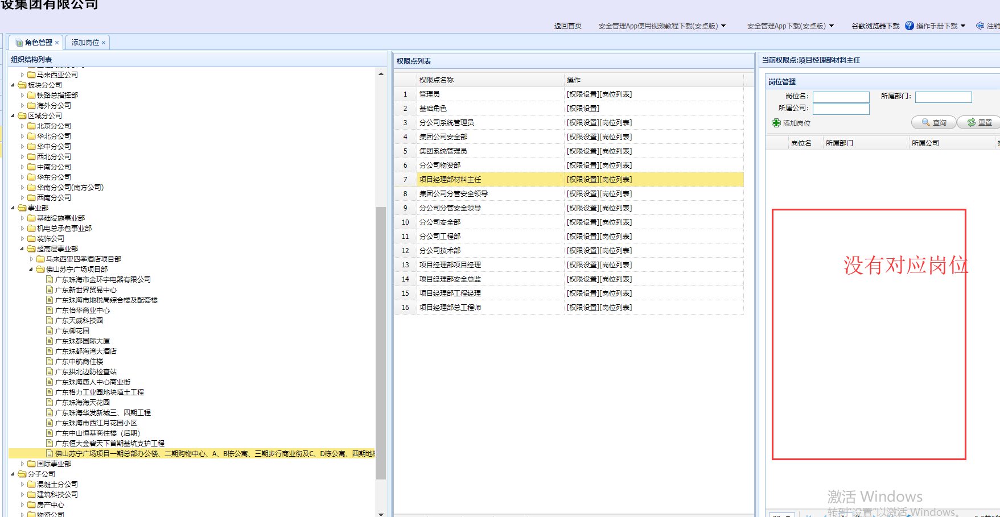

由于材料主任没有对应岗位, 所以审核角色中没有材料主任, 因此我们需要如下操作.

`解决方案`

* 通知李姐该项目的材料主任角色没有对应的岗位, 让其**添加对应岗位**.
* 将隐患的状态设置为`进场中(10)`, 然后通过`安全总监 & 录入人`进行**编辑** > **提交审核**即可.
* 移除以前的隐患产生的审核以及待审核相关数据.

```sql
-- 该记录的id为7896, 可以获取到工程id为2666
select status, project_oid from EQUP_Equipment_base_info where id = '7896';
-- 该工程下的角色岗位对应表中可以发现并没有材料主任
select * from t_s_role_position where userunitid = '2666';
select * from t_s_role where id = '63';			-- 项目经理
select * from t_s_role where id = '64'; 		-- 安全总监
select * from t_s_role where id = '66'; 		-- 总工程师
-- 恢复工程状态
update EQUP_Equipment_base_info set status = '10' where id = '7896';
-- 移除原有审核数据
delete from EQUP_equp_auditing where relation_id = '7896';
delete from EQUP_evalwo where relation_id = '7896';
-- 编辑 >提交审核 -- 此操作需要登录安全总监进行
```


## 190813-安全总监无法验证

`问题描述`


隐患治理系统安全总监无法验证.

`所需工具`

* `李行` `hang369`

`问题分析`

经过代码跟踪可以发现:

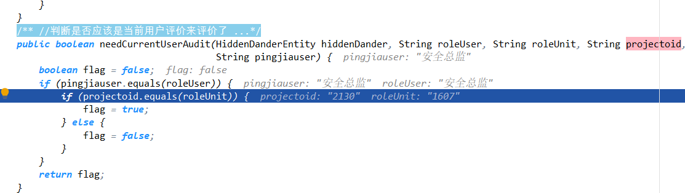

`roleUnit`的值与`projectoid`的值不符, 原因是甲方那边做过用户的项目迁移, 导致老的数据出现问题, 修复即可.

`解决方案`

```sql
-- 修改语句
update check_check set projectoId = '1607' where id = '477220';
-- 恢复语句
update check_check set projectoId = '2130' where id = '477220';
```


## 190823-图片上传出现问题

`问题描述`

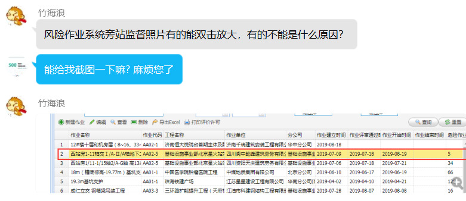

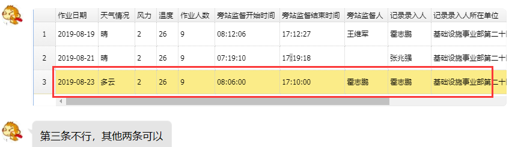

第三条不能点击放大.

`解决方案`

通过数据库查询, 我们发现CkEditor存值得时候出现了问题, 所以修复即可(不建议深究, 需要研究插件使用).

```sql
-- 查询语句
select supervisoryContent from TASK_Supervision where id = '144825';
-- 修改语句
update TASK_Supervision set supervisoryContent = '<html>
<head>
	<title></title>
</head>
<body>
<p align="center">高支模</p>

<p align="center"><a href="/upload/task/20190823/1566490329041.jpg" target="_blank"></a></p>

<p align="center"><a href="/upload/task/20190823/1566490337588.jpg" target="_blank"></a></p>

</body>
</html>' where id = '144825';
-- 恢复语句
update TASK_Supervision set supervisoryContent = '<html><head><title></title></head><body>高支模</body></html>' where id = '144825';
```


## * 126-190910-安全风险代办数量

`问题描述`

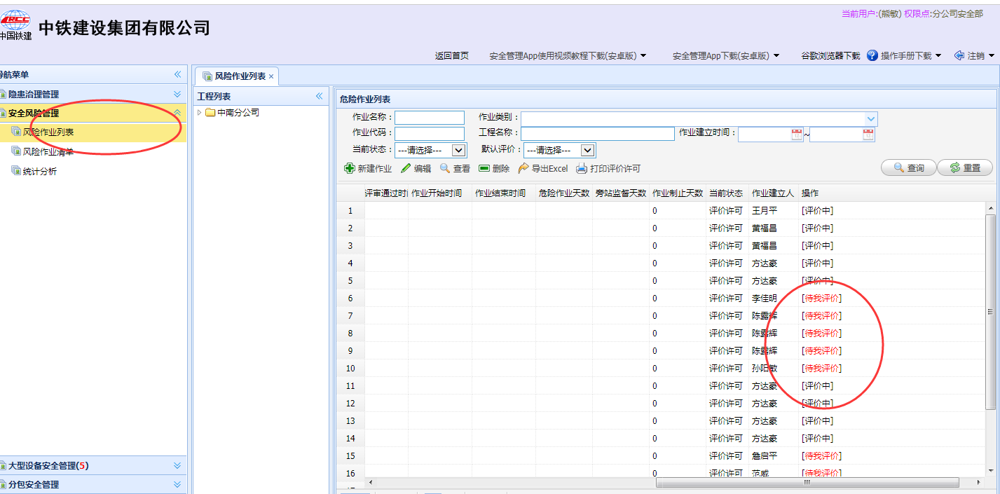

风险作业没有代办数量的展示, 有8个待我评价的记录, 但是并没有展示出来.

`解决方案`

经过代码跟踪, 我们发现`LoginController#getFunctionMap#817`行出现了问题, 这个个方法是**获取左侧菜单栏列表**用的, 可以看到代码是死代码 , 由于**危险作业**改过名字叫**风险作业**, 所以出现了如下问题, 修改即可:

```java
if(function.getFunctionName().equals("危险作业管理")
       || function.getFunctionName().equals("危险作业列表")
       || function.getFunctionName().equals("安全风险管理")		// 以前没有这个条件
       || function.getFunctionName().equals("风险作业列表")		// 以前没有这个条件
  ) {
    if(b != 0){
        function.setFunctionName(function.getFunctionName() + "(" + "<font color='red'>" + b + "</font>" + ")");
    }
}
```


```sql
select t.*,tc.categoryname ,tc.SUPREQUIRE as tcsuprequire,tc.PROP1 as tcprop1,tc.parentoid,tc.categorycode as tincode from Task_task t join task_taskcategory tc on t.categoryoid=tc.id left join (select TASKID,pingjiauser from task_evalwo group by TASKID,pingjiauser) t2 on t.ID=t2.taskid and t2.pingjiauser in ('151266')  where 1=1 and recordtime>'2013-11-14' and t.delflag!=-1 and t.status=1  and t.departids like'%,775,%' order by  t2.pingjiauser desc ,t.status asc,t.recordtime desc
```


## * 127-190923-无隐患逾期问题

`问题描述`

小程序和APP端出现无隐患的记录出现逾期天数的问题, 原因在于`无隐患记录`的整改截止日期应该是`NULL`, 如果继续传入值则会出现逾期天数.

`解决代码: SecurityHiddendangerApiController#hiddendangerSave#184`

```java
if("无隐患".equals(hic.getHiddenDescription())) {		// 如果为无隐患记录则应该将整改截止日期置空
    hiddenDander.setEndtime(null);
}
```


## * 128-190923-小程序运行慢

`问题描述`

客户说小程序运行慢, 很生气.

`解决方案`

可以看出小程序代码中的工具类`ZTJSQLUtils`&`AuditUtils`的实现代码中调用了`UnitUtils.getDWXZ()`以及`UserUtils.getUser`, 由于很多方法都会在方法中调用多次下面的方法, 这会造成严重的性能损失, 所以说... 去改吧... 别问了.. 去改吧.


## * 129-191008-新分包系统

`问题描述`

安全隐患录入隐患选择分包的接口有更新, 需要替换为新的.

`概念更换`

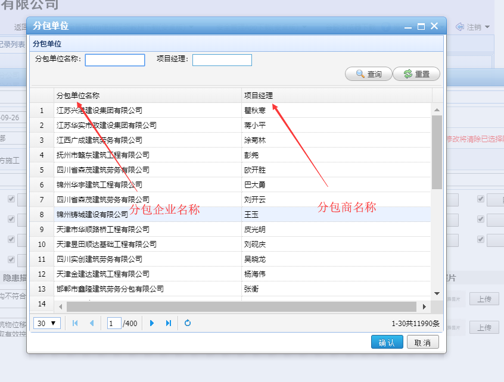

* `分包单位(老)` => `分包企业(新)`
* `项目经理(老)` => `分包商(新)`

`解决方案`

由于甲方已经提供好了接口, 我们只需要调用即可, 本次使用的工具为`HttpClient`, 配合`FastJson`来解析数据.

`1. jar包替换`

由于我们需要使用到`HttpClient`以及`FastJson`两个工具, 原系统当中这两个工具的版本已经不合适了, 需要我们替换为新版本的, 以及新的`HttpClient`还需要用到一些新的jar包, 需要我们手动替换.

* `httpcore-4.3.jar` 替换掉 `httpcore-4.2.2.jar` 
* `fastjson-1.2.35.jar` 替换掉 `fastjson-1.0.3.jar`
* 新增 `httpmime-4.3.1.jar` `fluent-hc-4.5.1.jar` `httpcore-nio-4.4.5.jar`
* 新增 `httpclient-4.3.1.jar` `httpasyncclient-4.1.2.jar` `httpclient-cache-4.3.1.jar`

`2. 新增实体类`

也就是新系统中的`FenBaoQiYe`以及`FenBaoShang`, 参照文档书写JavaBean即可.

`3. 新增工具`

`Constant`用于新分包系统相关的常量, `Response`用于分包系统返回JSON的固定格式, `HttpClientUtils`用于发送http请求.

`4. 核心服务`

`FeiBaoProxy`用于提供核心服务, 提供原来的系统应该提供的接口.


